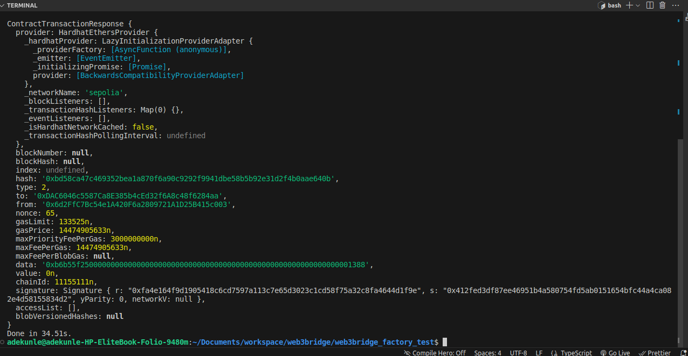
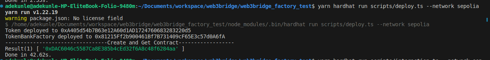

# INTERACTION RESULT

### TX HASH = 0xbd58ca47c469352bea1a870f6a90c9292f9941dbe58b5b92e31d2f4b0aae640b

Interacted with the deposit() function of the TokenBank contract in the address: 0xDAC6046c5587Ca8E385b4cEd32f6A8c48f6284aa
This TokenBank contract was created with TokenBankFactory contract found at the address: 0x81215Ff2b900461Bf7B731409cF65E3c57d0A6fA;


```shell
function deposit(uint256 _amount) external;
```

```
 TX HASH = 0xbd58ca47c469352bea1a870f6a90c9292f9941dbe58b5b92e31d2f4b0aae640b
```



